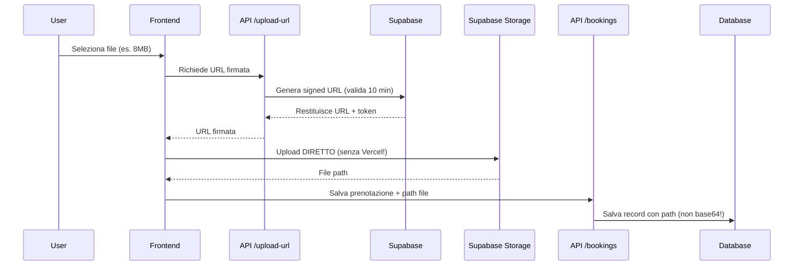

# 📦 Supabase Storage - Guida Completa

Sistema di upload documenti diretto per evitare limiti Vercel serverless functions.

---

## 🎯 Problema Risolto

**Prima**: File → base64 → Vercel API (limite 4.5MB) → Database (gonfiato)
**Dopo**: File → Supabase Storage diretto (fino a 10MB) → Database (solo path)

### Vantaggi
- ✅ **Nessun limite Vercel**: file non passano più dal server
- ✅ **File fino a 10MB**: alzato da 2MB
- ✅ **Database leggero**: salviamo solo path, non blob base64
- ✅ **Eliminazione automatica**: file temporanei auto-cancellati
- ✅ **Gratis**: 1GB storage + 2GB banda/mese

---

## 🛠️ Setup Iniziale (da fare UNA VOLTA)

### 1. Crea Progetto Supabase

1. Vai su https://supabase.com/dashboard
2. Click **"New Project"**
3. Compila:
   - **Name**: `gestione-prenotazioni-docs`
   - **Database Password**: `w0LzzO4RW15cOnKN` (già impostata)
   - **Region**: `Europe (Frankfurt)` (vicino Italia)
4. Aspetta ~2 minuti per creazione

### 2. Crea Storage Bucket

1. Sidebar → **Storage**
2. Click **"Create a new bucket"**
3. Compila:
   - **Name**: `patient-documents`
   - **Public bucket**: ❌ **NO** (deve essere privato!)
   - **File size limit**: 10MB
4. Click **"Create bucket"**

### 3. Configura RLS Policy (sicurezza)

1. Click sul bucket `patient-documents` appena creato
2. Tab **"Policies"** in alto
3. Click **"New policy"**
4. Seleziona template: **"Give service role full access"**
5. Assicurati siano selezionate TUTTE le operazioni:
   - ✅ SELECT, INSERT, UPDATE, DELETE
   - ✅ upload, download, list, update, move, copy, remove
   - ✅ createSignedUrl, createSignedUrls, getPublicUrl
6. **Target roles**: `service_role`
7. **Save policy**

Oppure SQL manuale:
```sql
CREATE POLICY "Service role full access"
ON storage.objects FOR ALL
TO service_role
USING (bucket_id = 'patient-documents');
```

### 4. Prendi Credenziali API

1. Sidebar → **Settings** → **API**
2. Copia:
   - **Project URL**: `https://apokejmxwaaygbnsvffr.supabase.co` ✅ (già configurato)
   - **Service Role Key** (secret): cerca la sezione "service_role", NON la "anon"!

⚠️ **IMPORTANTE**: La service_role key è SECRET, non committarla mai su GitHub!

### 5. Configura Environment Variables

**Locale (.env.local)**:
```bash
NEXT_PUBLIC_SUPABASE_URL=https://apokejmxwaaygbnsvffr.supabase.co
SUPABASE_SERVICE_ROLE_KEY=eyJhbG...la-tua-chiave-qui
```

**Vercel (Produzione)**:
1. Dashboard Vercel → Settings → Environment Variables
2. Aggiungi:
   - `NEXT_PUBLIC_SUPABASE_URL` = `https://apokejmxwaaygbnsvffr.supabase.co`
   - `SUPABASE_SERVICE_ROLE_KEY` = `[la tua service role key]`
3. Assicurati siano disponibili per **Production, Preview, Development**

---

## 📂 Struttura File Creati

```
/app/api/
  ├── upload-url/route.ts       # Genera URL firmate per upload
  └── delete-file/route.ts       # Elimina file (singoli o batch)

/lib/
  ├── supabase.ts                # Client Supabase configurato
  └── uploadToSupabase.ts        # Helper upload diretto

/app/prenotazioni/page.tsx       # Form modificato per upload diretto

/.env.local                      # Credenziali (NON committare!)
```

---

## 🔄 Come Funziona

### Flusso Upload (nuovo sistema)



### File Temporanei

I file vengono salvati in `temp/[email]/[uuid]-[filename].jpg`:
- `temp/` indica che sono temporanei
- Vengono eliminati dopo conferma prenotazione
- Oppure auto-eliminati dopo 24 ore via cleanup job

---

## 🧪 Test Locale

### 1. Verifica configurazione
```bash
# Controlla che le variabili siano caricate
npm run dev
# Apri http://localhost:3000/prenotazioni
# Apri console browser (F12)
```

### 2. Test upload piccolo (2MB)
- Seleziona un'immagine < 2MB
- Compila form e invia
- Controlla console: dovresti vedere `✅ Upload completato: temp/...`

### 3. Test upload grande (5-10MB)
- Seleziona un'immagine tra 5-10MB
- Prima avrebbe fallito (limite Vercel)
- Ora dovrebbe funzionare! ✅

### 4. Verifica su Supabase Dashboard
- Vai su Storage → `patient-documents`
- Dovresti vedere la cartella `temp/`
- Click su `temp/` → verifica file uploadati

---

## 🗑️ Eliminazione File

### Eliminazione Manuale (dopo prenotazione)
```typescript
import { deleteMultipleFiles } from '@/lib/uploadToSupabase';

// Dopo conferma/cancellazione prenotazione
const filePaths = [
  booking.documentoFrente,
  booking.documentoRetro,
  booking.documentoFrentePartner,
  booking.documentoRetroPartner,
].filter(Boolean); // Rimuovi null

await deleteMultipleFiles(filePaths);
```

### Cleanup Automatico (file vecchi)

**Opzione 1: Cron Job Vercel**
```json
// vercel.json
{
  "crons": [{
    "path": "/api/delete-file/cleanup",
    "schedule": "0 2 * * *"  // Ogni notte alle 2:00
  }]
}
```

**Opzione 2: GitHub Actions**
```yaml
# .github/workflows/cleanup-files.yml
name: Cleanup Old Files
on:
  schedule:
    - cron: '0 2 * * *'  # Ogni notte alle 2:00
jobs:
  cleanup:
    runs-on: ubuntu-latest
    steps:
      - name: Call cleanup endpoint
        run: |
          curl -X POST https://tuo-dominio.vercel.app/api/delete-file/cleanup \
            -H "Content-Type: application/json" \
            -d '{"maxAgeHours": 24}'
```

**Opzione 3: Manuale**
```bash
# Elimina file più vecchi di 24 ore
curl -X POST https://localhost:3000/api/delete-file/cleanup \
  -H "Content-Type: application/json" \
  -d '{"maxAgeHours": 24}'
```

---

## 🔒 Sicurezza e Privacy (GDPR)

### Cosa è protetto
- ✅ **Bucket privato**: nessun accesso pubblico
- ✅ **URL firmate**: valide solo 10 minuti
- ✅ **Service role**: solo server ha accesso completo
- ✅ **RLS policies**: controllo granulare degli accessi
- ✅ **File temporanei**: auto-eliminati dopo 24h

### Conformità GDPR
- I file sono considerati dati personali sensibili
- Conservati solo il tempo necessario (24h max)
- Eliminati automaticamente o dopo conferma
- Accesso limitato solo al backend con credenziali sicure

---

## 📊 Monitoring e Debugging

### Verifica upload
```typescript
// Console browser dovrebbe mostrare:
📤 Upload documenti a Supabase...
📤 Inizio upload: documento-fronte.jpg (3.45 MB)
✅ Upload completato: temp/paziente@example.com/uuid-1234.jpg
✅ Upload completato: { docFrontePath: 'temp/...', docRetroPath: 'temp/...' }
```

### Errori comuni

**❌ "Mancano le credenziali Supabase"**
- Controlla `.env.local` esista
- Verifica variabili `NEXT_PUBLIC_SUPABASE_URL` e `SUPABASE_SERVICE_ROLE_KEY`
- Restart dev server: `npm run dev`

**❌ "Errore generazione URL upload" (403/401)**
- Controlla RLS policy su bucket
- Verifica che `service_role` key sia corretta (non `anon` key!)
- Controlla nome bucket: `patient-documents`

**❌ "Errore upload file" (500)**
- Controlla dimensione file < 10MB
- Verifica tipo file consentito (jpg, png, webp, pdf)
- Controlla quota Supabase (1GB max)

### Logs Supabase
- Dashboard → **Logs** → **Storage Logs**
- Filtra per bucket: `patient-documents`
- Verifica upload, download, delete

---

## 💰 Costi e Limiti

### Piano Free Supabase
- ✅ **Storage**: 1GB (sufficiente per ~1000 documenti da 1MB)
- ✅ **Bandwidth**: 2GB/mese (download + upload)
- ✅ **API requests**: 50.000/mese

### Stima Utilizzo
- Upload 4 documenti per prenotazione: ~4MB
- 100 prenotazioni/mese = 400MB storage + 400MB bandwidth
- Eliminazione dopo 24h = storage stabile ~20MB
- **Conclusione**: Piano free più che sufficiente! 🎉

Se superi limiti:
- Pro plan: $25/mese → 8GB storage + 50GB bandwidth

---

## 🔧 Troubleshooting

### Reset completo (se qualcosa non funziona)

1. **Elimina bucket**:
   - Storage → `patient-documents` → Settings → Delete bucket

2. **Ricrea tutto**:
   - Segui nuovamente "Setup Iniziale" sopra

3. **Rigenera credenziali**:
   - Settings → API → Reset service_role key
   - Aggiorna `.env.local` e Vercel env vars

### Test API manualmente

```bash
# Test generazione URL firmata
curl -X POST http://localhost:3000/api/upload-url \
  -H "Content-Type: application/json" \
  -d '{
    "fileName": "test.jpg",
    "fileType": "image/jpeg",
    "patientEmail": "test@example.com"
  }'

# Risposta attesa:
# {
#   "uploadUrl": "https://...signed-url...",
#   "filePath": "temp/test@example.com/uuid-test.jpg",
#   "token": "..."
# }
```

---

## 📚 Risorse Utili

- [Supabase Storage Docs](https://supabase.com/docs/guides/storage)
- [RLS Policies Guide](https://supabase.com/docs/guides/storage/security/access-control)
- [Signed URLs](https://supabase.com/docs/guides/storage/uploads/signed-upload-urls)

---

## ✅ Checklist Setup Completo

- [ ] Progetto Supabase creato
- [ ] Bucket `patient-documents` creato (privato)
- [ ] RLS policy configurata (service role full access)
- [ ] Credenziali copiate (URL + service_role key)
- [ ] `.env.local` configurato con credenziali
- [ ] Vercel env vars aggiunte (produzione)
- [ ] Test locale upload piccolo (< 2MB) ✅
- [ ] Test locale upload grande (5-10MB) ✅
- [ ] Verifica file su Supabase Dashboard ✅
- [ ] Cleanup automatico configurato (cron/GitHub Actions)

---

🎉 **Setup completo!** Il sistema è pronto per gestire upload documenti senza limiti Vercel.
